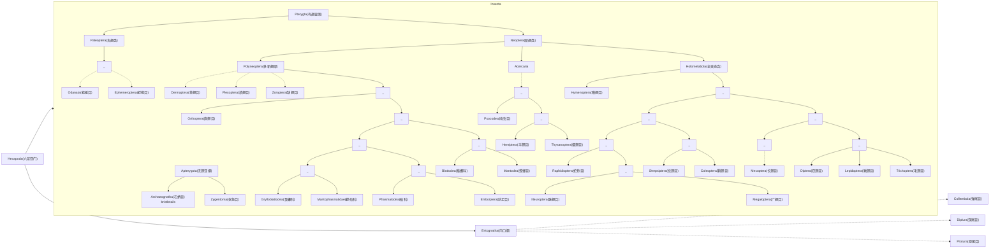

大致的系统发生图如下：

```mermaid
graph LR
	Hexapoda["Hexapoda(六足亚门)"]
	Hexapoda --> Entognatha["Entognatha(内口纲)"]
	Entognatha -.-> Collembola["Collembola(弹尾目)"]
	Entognatha -.-> Diplura["Diplura(双尾目)"]
	Entognatha -.-> Protura["Protura(原尾目)"]
	Hexapoda --> Insecta["Insecta(昆虫纲)"]
	subgraph Insecta
		Apterygota["Apterygota(无翅亚纲)"]
		Pterygta["Pterygta(有翅亚纲)"]
		Pterygta --> Paleoptera["Paleoptera(古翅类)"]
		Pterygta --> Neoptera["Neoptera(新翅类)"]
		Neoptera --> Polyneoptera["Polyneoptera(多新翅部)"]
		Neoptera --> Acercaria["Acercaria"]
		Neoptera --> Holometabola["Holometabola(全变态类)"]
		Apterygota --> Archaeognatha["Archaeognatha(石蛃目) bristletails"]
		Apterygota --> Zygentoma["Zygentoma(衣鱼目)"]
	
		Paleoptera --> A["_"]
		A -.-> Odonata["Odanata(蜻蜓目)"]
		A -.-> Ephemeroptera["Ephemeroptera(蜉蝣目)"]
	
		Polyneoptera -.-> Dermaptera["Dermaptera(革翅目)"]
		Polyneoptera -.-> Plecoptera["Plecoptera(𫌀翅目)"]
		Polyneoptera -.-> Zoraptera["Zoraptera(缺翅目)"]
	
		Polyneoptera --> B["_"]
			B --> Orthoptera["Orthoptera(直翅目)"]
			B --> B1["_"]
				B1 --> B11["_"]
					B11 --> B111["_"]
					B111 --> Grylloblattodea["Grylloblattodea(蛩蠊科)"]
					B111 --> Mantophasmatodea["Mantophasmatidae(螳脩科)"]
				B11 --> B112["_"]
					B112 --> Phasmatodea["Phasmatodea(脩科)"]
					B112 --> Emboiptera["Emboiptera(纺足目)"]
				B1 --> B12["_"]
					B12 --> Blattodea["Blattodea(蜚蠊科)"]
					B12 --> Mantodea["Mantodea(螳螂目)"]
		Acercaria -.-> C["_"]
			C --> Psocodea["Psocodea(啮虫目)"]
			C --> C1["_"]
				C1 --> Hemiptera["Hemiptera(半翅目)"]
				C1 --> Thysanoptera["Thysanoptera(缨翅目)"]
		Holometabola --> Hymenoptera["Hymenoptera(膜翅目)"]
		Holometabola --> D["_"]
			D --> D1["_"]
				D1 --> D11["_"]
					D11 --> Raphidioptera["Raphidioptera(蛇蛉目)"]
					D11 --> D111["_"]
						D111 --> Neuroptera["Neuroptera(脉翅目)"]
						D111 --> Megaloptera["Megaloptera(广翅目)"]
				D1 --> D12["_"]
					D12 --> Strepsiptera["Strepsiptera(捻翅目)"]
					D12 --> Coleoptera["Coleoptera(鞘翅目)"]
			D --> D2["_"]
				D2 --> D21["_"]
					D21 -.-> Mecoptera["Mecoptera(长翅目)"]
					D22 --> Diptera["Diptera(双翅目)"]
				D2 --> D22["_"]
					D22 --> Lepidoptera["Lepidoptera(鳞翅目)"]
					D22 --> Trichoptera["Trichoptera(毛翅目)"]
					
			
	end

	
```
