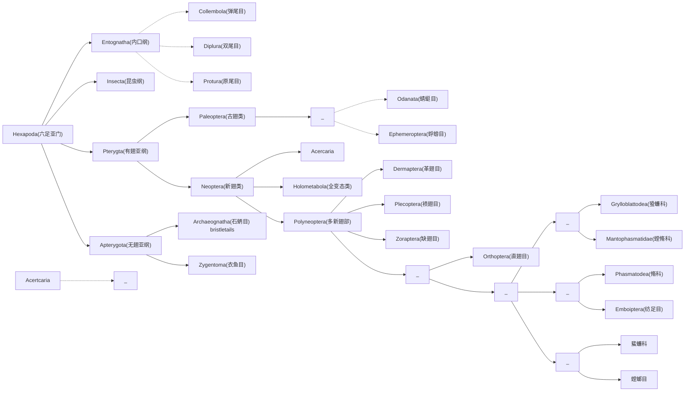

大致的系统发生图如下：

```mermaid
graph LR
	Hexapoda["Hexapoda(六足亚门)"]
	Hexapoda --> Entognatha["Entognatha(内口纲)"]
	Entognatha -.-> Collembola["Collembola(弹尾目)"]
	Entognatha -.-> Diplura["Diplura(双尾目)"]
	Entognatha -.-> Protura["Protura(原尾目)"]
	Hexapoda --> Insecta["Insecta(昆虫纲)"]
	Hexapoda --> Apterygota["Apterygota(无翅亚纲)"]
	Hexapoda --> Pterygta["Pterygta(有翅亚纲)"]
	Pterygta --> Paleoptera["Paleoptera(古翅类)"]
	Pterygta --> Neoptera["Neoptera(新翅类)"]
	Neoptera --> Polyneoptera["Polyneoptera(多新翅部)"]
	Neoptera --> Acercaria["Acercaria"]
	Neoptera --> Holometabola["Holometabola(全变态类)"]

	Apterygota --> Archaeognatha["Archaeognatha(石蛃目) bristletails"]
	Apterygota --> Zygentoma["Zygentoma(衣鱼目)"]

	Paleoptera --> A["_"]
	A -.-> Odonata["Odanata(蜻蜓目)"]
	A -.-> Ephemeroptera["Ephemeroptera(蜉蝣目)"]

	Polyneoptera --> Dermaptera["Dermaptera(革翅目)"]
	Polyneoptera --> Plecoptera["Plecoptera(𫌀翅目)"]
	Polyneoptera --> Zoraptera["Zoraptera(缺翅目)"]

	Polyneoptera --> B["_"]
		B --> Orthoptera["Orthoptera(直翅目)"]
		B --> B1["_"]
			B1 --> B11["_"]
				B11 --> Grylloblattodea["Grylloblattodea(蛩蠊科)"]
				B11 --> Mantophasmatodea["Mantophasmatidae(螳脩科)"]
			B1 --> B12["_"]
				B12 --> Phasmatodea["Phasmatodea(脩科)"]
				B12 --> Emboiptera["Emboiptera(纺足目)"]
			B1 --> B13["_"]
				B13 --> Blattodea["蜚蠊科"]
				B13 --> Mantodea["螳螂目"]
	Acertcaria -.-> C["_"]
	
```
